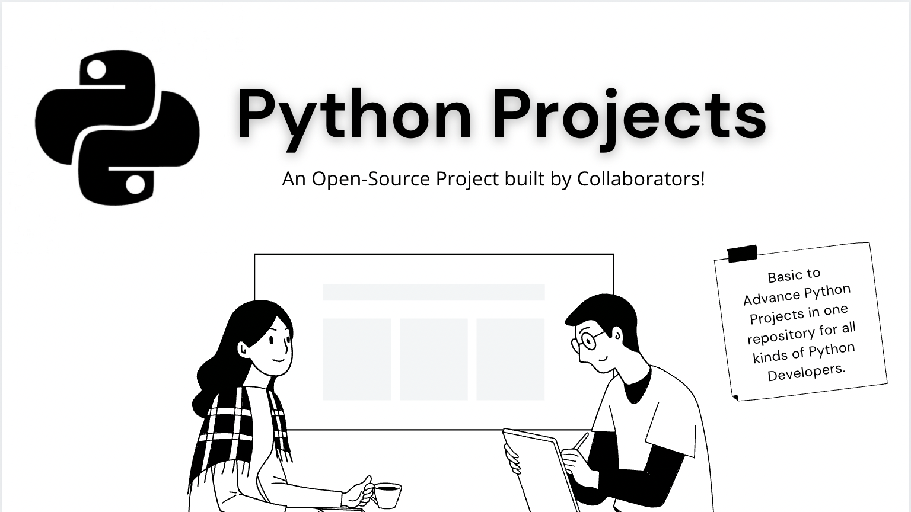

# Python Projects

<link rel="shortcut icon" type="image/x-icon" href="./images/icon.png">

 

<!--   
 -->

 

# 📌 Introduction

The repository was built with a tree-like structure in mind, it contains collections of **Python Projects**. Most people are afraid of Good Projects, which keeps them from getting into Python programming. It's not true, anyone can learn Python, and we plan to make it happen. The repository is open to anyone, whether you are a beginner or an expert developer.

 

> We believe that Developing projects is more important than just learning theory. ✅

 

# 📚 Resources

Here are the [resources](./python-resources) to get you started with the basics and fundamentals of Python.

- [Python Websites](https://github.com/gaurtvin/python-projects/tree/master/python-resources#python-websites)
- [Python Books](https://github.com/gaurtvin/python-projects/tree/master/python-resources#python-books)
- [Python Repository](https://github.com/gaurtvin/python-projects/tree/master/python-resources#python-repositories)
- [Python Course/Videos](https://github.com/gaurtvin/python-projects/tree/master/python-resources#python-coursesvideos)

 

# 🤖 Project List

<table width="100%" class="table">
<tr>
<th>S.No</th>
<th>Name</th>
<th>Author</th>
</tr>
<tr><td>1.</td><td><a target="_blank" href="https://github.com/gaurtvin/python-projects/tree/master/projects/digital-clock">Digital Clock GUI</a></td><td><a href="https://github.com/gaurtvin"> Gaurav Pandey</a></</td></tr>
<tr><td>2.</td><td><a target="_blank" href="https://github.com/gaurtvin/python-projects/tree/master/projects/Tic-Tac-Toe">Tic Tac Toe GUI</a></td><td><a href="https://github.com/TanCodes"> Tanmay Barvi</a></td></tr>
<tr><td>3.</td><td><a target="_blank" href="https://github.com/gaurtvin/python-projects/tree/master/projects/Simple-Quote-Bot">Simple Quote Bot</a></td><td><a href="https://github.com/gaurtvin"> Gaurav Pandey</a></td></tr>
<tr><td>4.</td><td><a target="_blank" href="https://github.com/gaurtvin/python-projects/tree/master/projects/Windows-Message-Notifier">Windows Desktop Message Notifier GUI</a></td><td><a href="https://github.com/gaurtvin"> Gaurav Pandey</a></td></tr>
<tr><td>5.</td><td><a target="_blank" href="https://github.com/gaurtvin/python-projects/tree/master/projects/Url-Shortner">URL Shortner</a></td><td><a href="https://github.com/gaurtvin"> Gaurav Pandey</a></td></tr>
</table> 

 

# ✨ Contribution

Feel free to add more Projects to this repository by either creating an issue or making a Pull Request. Join our [Discord Server](https://discord.gg/dWeV3pjqu2) for latest updates, further discussion about your pull request.

See our [Contribution Guidelines](CONTRIBUTING.md) to get started. Also please see [**README_PROJECT_TEMPLATE.md**](https://github.com/gaurtvin/python-projects/blob/master/README_PROJECT_TEMPLATE.md) before making pull request.

<!-- ## 🥳 Our Contributors

<table style="border:none">
	<tr>
		<td>
			
		</td>
	</tr>
</table>

Be the next to contribute and you'll see yourself in this chart! -->

<!-- # 📝 Project Maintainers

<table align=center>
<tr>

<td align="center"> 
<h4>Tanmay Barvi</h4>
</td>

<td align="center"> 
<h4>Gaurav Pandey</h4>
</td>

</tr>
</table> -->

 

# ⚖️ License

This repository is Lincesd under [MIT](https://choosealicense.com/licenses/mit/) License!
