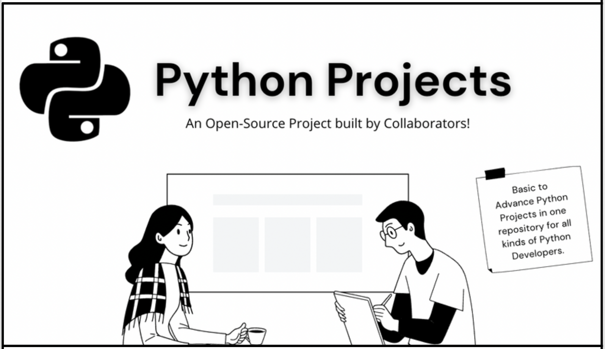

     

# Introduction

The repository was built with a tree-like structure in mind, it contains lots of Python Projects. A lot of the fear people have of Good Projects, this stops people from going into Programming in Python. It's not true!, anyone can learn Python, and we plan to make that happen. This repository is for anyone whether you are beginner or intermediate programmer.

Here is a [resource](./python-resources) to get you started with the basics and fundamentals of Python.

# Resources

- [Python Websites](https://github.com/gaurtvin/python-projects/tree/master/python-resources#python-websites)
- [Python Books](https://github.com/gaurtvin/python-projects/tree/master/python-resources#python-books)
- [Python Repository](https://github.com/gaurtvin/python-projects/tree/master/python-resources#python-repositories)
- [Python Course/Videos](https://github.com/gaurtvin/python-projects/tree/master/python-resources#python-coursesvideos)

<!-- Projects

<table width="100%" class="table">
<tr>
<th>S.No</th>
<th>Name</th>
<th>Author</th>
</tr>
<tr><td>1.</td><td><a target="_blank" href="https://github.com/gaurtvin/python-projects/tree/master/projects/digital-clock">Digital Clock GUI</a></td><td><a href="https://github.com/gaurtvin"> Gaurav Pandey</a></</td></tr>
<tr><td>2.</td><td><a target="_blank" href="https://github.com/gaurtvin/python-projects/tree/master/projects/Tic-Tac-Toe">Tic Tac Toe GUI</a></td><td><a href="https://github.com/TanCodes"> Tanmay Barvi</a></td></tr>
</table> -->

# Contribution

Feel free to add more Projects to this repository by either creating an issue or making a Pull Request. See our [Contribution Guidelines](CONTRIBUTING.md) to get started. Join our [Discord Server](https://discord.gg/dWeV3pjqu2) for latest updates and further discussion.

Please see **README_PROJECT_TEMPLATE.md** before making pull request.

# License

This repository is under [MIT](LICENSE) License.
