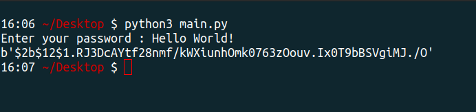

# Password Hashing

This is a simple Python3 script for hashing strings

# Prerequisites

It requires no prerequisites, you only need to have a basic knowledge of Python and how to run the code in your terminal. If you don't have Python installed, you can visit [here](https://www.python.org/downloads/) to download Python.


# Library Used(1)

- [Bcrypt](https://pypi.org/project/bcrypt)

# How to run the code locally

- Clone this Repository

```
git clone https://github.com/gaurtvin/python-projects.git
```

- Go to the Project directory

```
cd python-projects
```

- Go to the projects folder

```
cd projects
```

- Go to the Password-Hashing folder

```
cd  Password-Hashing
```

- Install the bycrypt

```
pip3 install bcrypt
```

- Run the following command

```
python main.py
```

# Sample use of the code



# Author's name

[Med Amine Fh](https://github.com/medaminefh)
