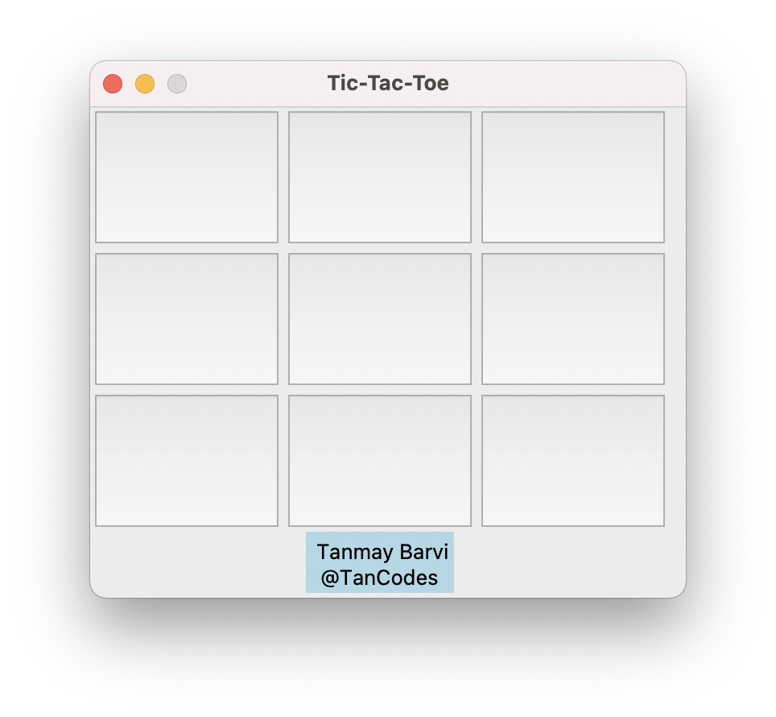
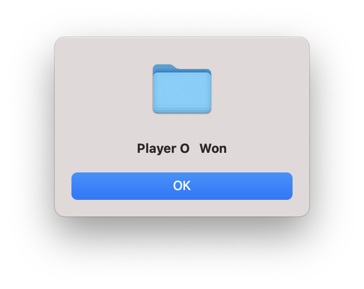
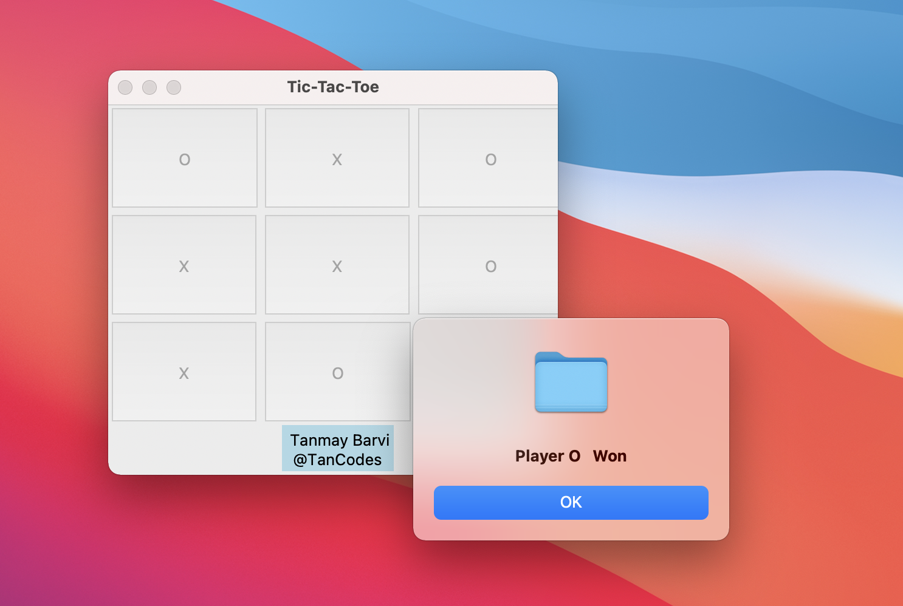

# Tic Tac Toe

<p align="center">
  
  
</p>

## Overview

Tic-tac-toe, noughts and crosses, or Xs and Os/“X’y O’sies”, is a paper-and-pencil game for two players, X and O, who take turns marking the spaces in a 3×3 grid. The player who succeeds in placing three of their marks in a diagonal, horizontal, or vertical row is the winner.
But wait , it's not a game on paper it's a game on computer!

## Prerequisites

- Little bit more experience with Python programming language.

## Library Used

- [Tkinter](https://docs.python.org/3/library/tkinter.html)

Make sure, you already installed **Python 3.8** or above versions. Now run the following commands in your Terminal for installing libraries.

## Step to Run the Code

- Clone this Repository

  ```
      git clone https://github.com/gaurtvin/python-projects.git
  ```

- Go to Project directory

  ```
  cd python-projects
  ```

- Go to Projects folder

  ```
  cd projects
  ```

- Now, go to Tic-Tac-Toe folder

  ```
  cd Tic-Tac-Toe
  ```

- Run the following command
  ```
  python tic_tac_toe.py
  ```

### Now, I'm expecting this Output



## About Author

I am Tanmay a Self-Taught Web and Python developer with a keen interest in Web Development, Data Analytics, and Software development. I have experience using Python in various projects from last 2 years. Also, I'm a Open-Source contributor. You can catch me on [Twitter](https://twitter.com/TanCodes) and [LinkedIn](https://linkedin.com/in/tanmay-barvi-2a0206126).

Any comments, suggestions or corrections are welcome. This repository is licensed under [MIT](https://opensource.org/licenses/MIT) License.

## Happy Coding!
