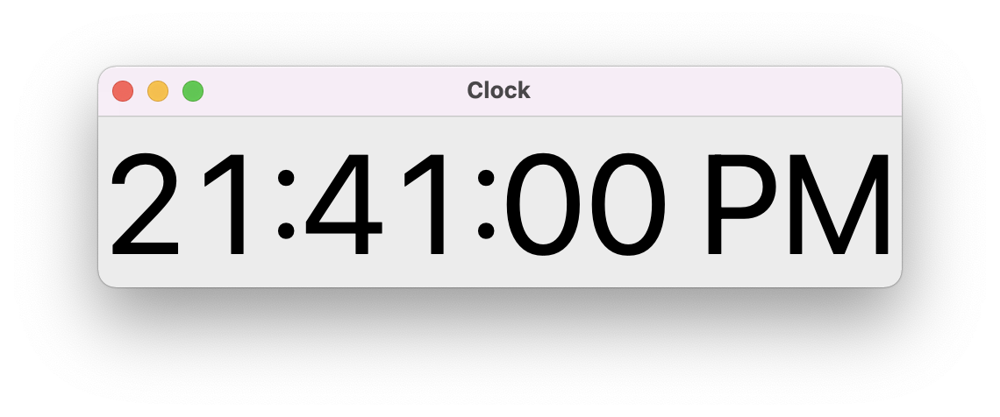

# Digital Clock



## Overview

This Python program shows real time in Digital format I make this project with just 13 lines of code especially for medium level python programmers. You can modify It's Background and Foreground colour, Fonts any many more..

## Prerequisites

- Little bit experience with Python programming language.
- Very basic terminal commands.

## Library Used

- [Tkinter](https://docs.python.org/3/library/tkinter.html)
- [Time](https://docs.python.org/3/library/time.html)

Make sure, you already installed **Python 3.8** or above versions. Now run the following commands in your Terminal for installing libraries.

```bash
pip3 install tk
```

## Run Code locally

- Clone this Repository

  ```bash
      git clone https://github.com/gaurtvin/python-projects.git
  ```

- Go to Project directory

  ```bash
  cd python-projects
  ```

- Go to Projects folder

  ```bash
  cd projects
  ```

- Now, go to digital-clock folder

  ```bash
  cd digital-clock
  ```

- Run the following command
  ```bash
  python3 code.py
  ```

### Now, I'm expecting this Output


## About Author

Hey, I am Gaurav 14 y/o New in Programing from India, I love to contribute to Open-Source in Python and Machine Learning. You can catch me on [Twitter](https://twitter.com/gaurtvin) and [LinkedIn](https://linkedin.com/in/gaurtvin).

Any comments, suggestions or corrections are welcome. Contribution are welcome as This repository is licensed under [MIT](https://opensource.org/licenses/MIT) License.

## Happy Coding!
